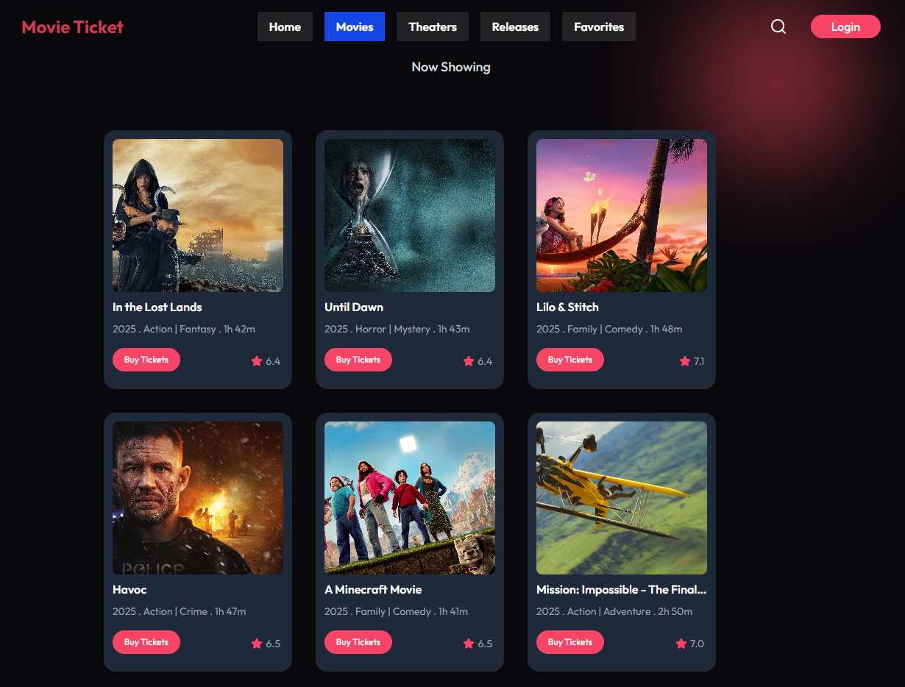
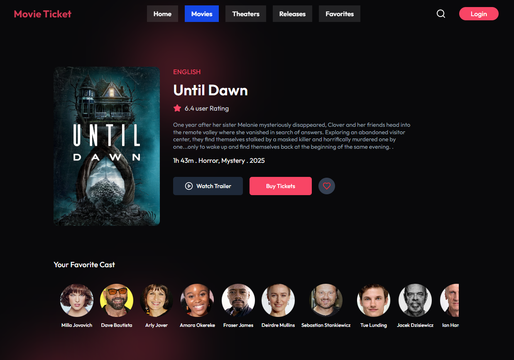
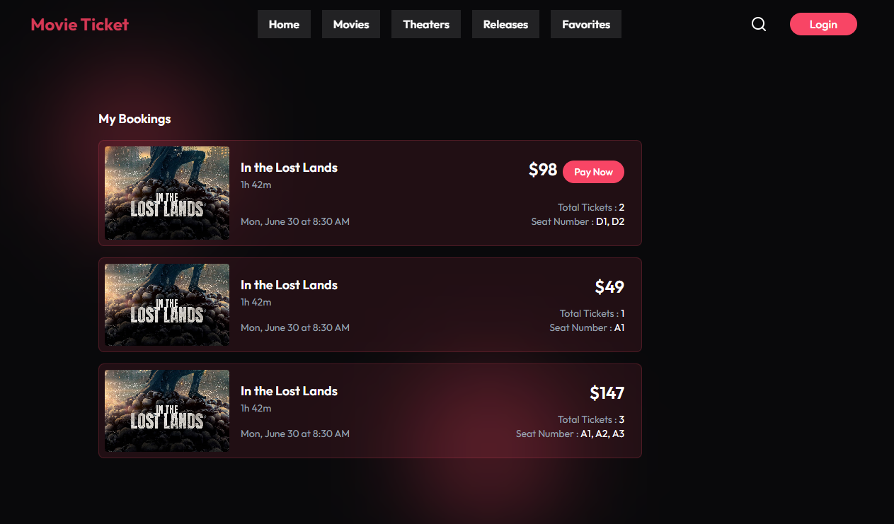

# Online Movie Ticket Management System

A full-stack web application for seamless movie ticket booking, built with React, Node.js,Express, and MongoDB.

## Screenshots

 |

## Features

-   **User Authentication:** Secure sign up, login, and session management.
-   **Browse Movies:** View currently running and upcoming movies with details and trailers.
-   **Showtimes & Booking:** Select showtimes, choose seats, and book tickets in real-time.
-   **Booking History:** Users can view and manage their past and upcoming bookings.
-   **Admin Dashboard:** Manage movies, shows, and view all bookings.
-   **Responsive UI:** Modern, mobile-friendly interface for a smooth user experience.

## Tech Stack

-   **Frontend:** React, Vite, CSS
-   **Backend:** Node.js, Express
-   **Database:** MongoDB
-   **Authentication:** JWT (JSON Web Tokens)
-   **Deployment:** Vercel (or your preferred platform)

-   `POST /api/auth/register` – Register a new user
-   `POST /api/auth/login` – Login
-   `GET /api/movies` – List all movies
-   `GET /api/shows` – List all shows
-   `POST /api/bookings` – Book tickets
-   ...and more
